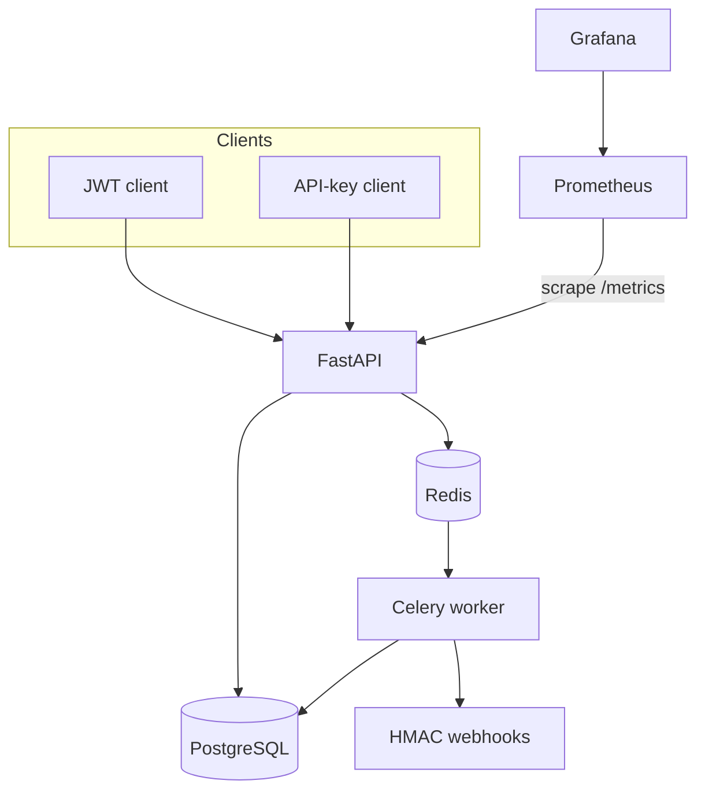
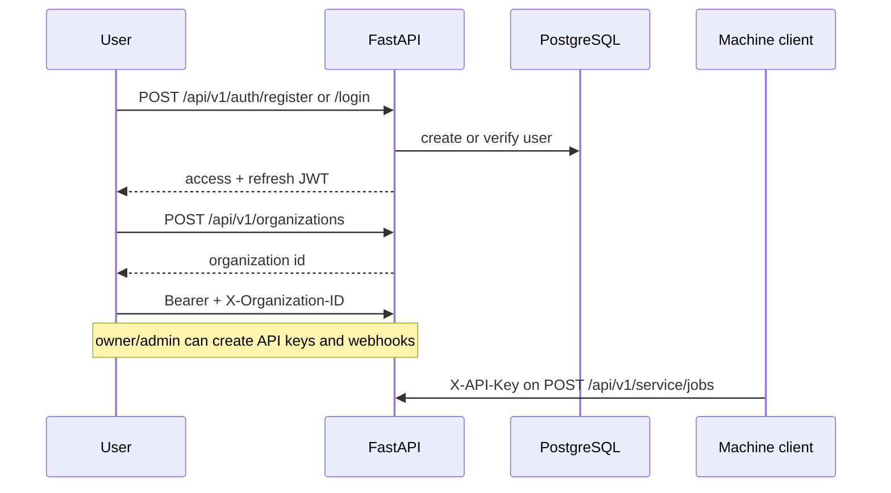
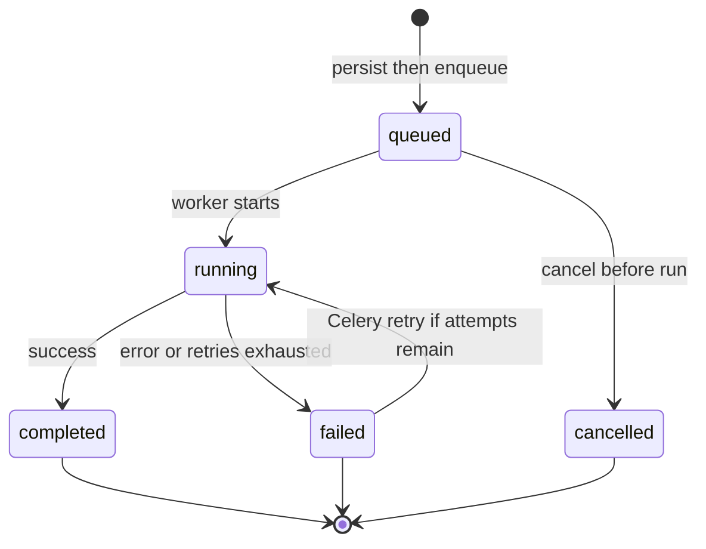

# CloudTask API

Multi-tenant async job API: FastAPI, PostgreSQL, Redis, Celery. Optional Prometheus/Grafana, Docker Compose, and Kubernetes manifests.

## Architecture



## Auth flow



## Job lifecycle



On `completed` / `failed`, the worker may POST signed webhooks (`job.completed`, `job.failed`).

## Features

- JWT access/refresh tokens; hashed, revocable API keys
- Organizations with owner/admin/member roles
- Tenant-scoped jobs: create, list, get, retry, cancel; idempotency keys
- Celery workers with attempt history and bounded retries
- HMAC-SHA256 webhook deliveries with delivery records
- Redis fixed-window rate limiting
- `/health`, `/ready`, `/metrics`
- Docker Compose, GitHub Actions CI, Kubernetes + HPA

## Quick start

```bash
cp .env.example .env
docker compose up -d --build
docker compose exec api alembic upgrade head
```

If no migration exists yet:

```bash
docker compose exec api alembic revision --autogenerate -m "initial schema"
docker compose exec api alembic upgrade head
```

| Service | URL |
|---------|-----|
| Swagger | http://localhost:8000/docs |
| Metrics | http://localhost:8000/metrics |
| Prometheus | http://localhost:9090 |
| Grafana | http://localhost:3000 (`admin` / `admin`, local only) |

Core stack without monitoring:

```bash
docker compose up -d --build api worker postgres redis
```

## API overview

| Area | Prefix | Auth |
|------|--------|------|
| Auth | `/api/v1/auth` | public register/login/refresh |
| Orgs | `/api/v1/organizations` | JWT |
| Jobs | `/api/v1/jobs` | JWT + `X-Organization-ID` |
| API keys | `/api/v1/api-keys` | JWT + org; owner/admin |
| Webhooks | `/api/v1/webhooks` | JWT + org; owner/admin |
| Service jobs | `/api/v1/service/jobs` | `X-API-Key` |

## Webhooks

Events: `job.completed`, `job.failed`.

Delivery headers:

- `X-CloudTask-Event`
- `X-CloudTask-Signature` — HMAC-SHA256 of the raw JSON body

## Layout

```text
app/            API, models, schemas, Celery workers
alembic/        DB migrations
monitoring/     Prometheus + Grafana
deploy/         Kubernetes manifests; Terraform notes
docs/           architecture and security notes
tests/          unit tests
```

## Docs

- [Architecture](docs/architecture.md)
- [Security](docs/security.md)

## Limitations

- Service-job `created_by` is set to an org owner when no user is on the API key
- Terraform under `deploy/terraform/` is notes only (no modules yet)
- `AuditLog` model exists but is not wired into request handlers
